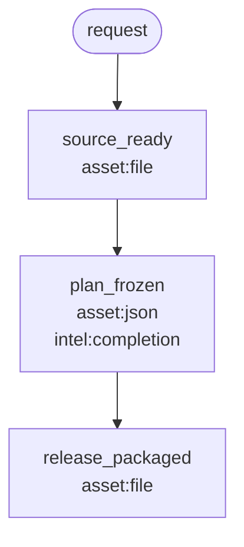

# M8M harness builder

A Codex / Claude **skill that writes a split**: milestones, FlowSteps, tools, one table, one flowchart.

M8M = **milestone to milestone**. It is a lightweight skill writer, not a production OS.

## The problem

Skills that ship assets (infographics, packages, fetches, renders) keep failing the same way:

1. **Intelligence eats the job.** The model writes SQL, crop math, Playwright, or a one-off downloader in the session. Tiny typed work becomes a prompt.
2. **Tools live in the skill folder.** Scripts sit in `~/.codex/skills` / `~/.claude/skills` instead of the product repo. The next run invents them again.
3. **n8n is too stiff.** Every HTTP call and crop is its own canvas node. A human checkpoint (“source is bound”, “plan is frozen”) disappears under action nodes.
4. **The opposite rigidity is also wrong.** Forbidding the agent from recovering when a tool fails, or treating FlowSteps as a production guardrail, makes a dead pipeline. Inside a checkpoint, work is still a normal skill.

The overuse is not “AI exists.” It is AI used as the first move, with no harness for the thing that must exist, and no preferred repo tool for the thing that should be Python.

## The solution

Invert n8n’s grain. Keep typed I/O. Move the canvas up to **milestones**. Put **FlowSteps** inside. Prefer **one repo tool** per FlowStep. The builder develops that tool (fetch a table, call MCP, crop, hash). If the tool is missing or fails, recover like a normal agent. The **milestone asset** is still non-negotiable.

```text
n8n:   node = one action
M8M:   node = one milestone (harness)
       this.in = previous.out
       FlowSteps = atomic goals inside that node (guide)
       Tool = the one preferred Python for a FlowStep (optional)
```

| Word | Compulsory? | Meaning |
| --- | --- | --- |
| **Milestone** | **Yes — the harness** | A person-shaped checkpoint. Input is the previous output. It must produce a declared **asset** (file, image, json proof, or data). If that asset is not produced: **BLOCK**. The next milestone does not start. |
| **FlowStep** | **Guide** | An atomic goal *inside* a milestone (bind five images, fetch a record). Prefers **one** tool. Sequence comes from the table. How it gets there is a normal skill. |
| **Tool** | **Preferred, optional** | Python at `<repo>/flowsteps/tools/<id>/`. The builder should develop it. Existing, promote from a skill script, or generate-new stub. If it fails: find a way, still aimed at the milestone asset. |

This is the whole skill:

```text
identify milestones
  → list FlowSteps inside each (atomic; prefer ONE tool)
  → develop that tool (existing / promote / generate-new)
  → write one FlowStep table + one milestone flowchart
  → scaffold flow.yaml and tool stubs
```

`$m8m-harness-builder` **writes** that split. It does not refuse to draw because a name looks like `crop_*`. A stub tool is a successful sketch. The milestone output schema is not a sketch.

## Table (guide)

Two tables land on `planning/m8m-flowchart.md`.

**FlowSteps — the sequence inside each checkpoint.** Prefer the named tool, in this order. Optional. If it fails, recover like a normal agent. The milestone asset is still compulsory.

| Milestone | # | FlowStep | Preferred tool |
| --- | ---: | --- | --- |
| `source_ready` | 1 | `fetch_record` | `fetch_record` |
| `source_ready` | 2 | `hash_bind` | `hash_bind` |
| `plan_frozen` | 1 | `compact_plan` | `compact_editorial_config` |
| `release_packaged` | 1 | `materialize_package` | `materialize_package` |

**Origin — where that Python comes from.** Existing toolbox, promote a skill script into the repo, or generate-new (the builder should develop it; a stub is a sketch).

| Milestone | Asset | Existing toolbox | Promote from a skill script | Generate new |
| --- | --- | --- | --- | --- |
| `source_ready` | `file` | `hash_bind` | `fetch_record` ← `scripts/fetch_record.py` | — |
| `plan_frozen` | `json` | — | — | `compact_editorial_config` |
| `release_packaged` | `file` | — | `materialize_package` ← `scripts/package.py` | — |

Proceed FlowSteps in table order. Do not treat that path as a production lock. Do not skip the asset.

## Chart (harness)

One mermaid canvas. **Nodes are milestones, not crops.** Each node names the required asset. Missing it is BLOCKED. FlowSteps are not extra nodes; they live in the table above.



| Kind | Proof on the milestone |
| --- | --- |
| `file` | `asset.path` + `asset.sha256` |
| `image` | same file receipt, for a picture |
| `json` | closed object with required fields |
| `data` | same: typed required fields |

If/else and foreach are optional **schema gates** on a milestone (`next.when` / `foreach`). They appear on the same chart. The model does not approve the branch.

A name like `crop_4x5` on `--milestone` is a **note** (“looks like a tool”), not a refusal to draw.

## What is rigid vs what is not

| Event | Result |
| --- | --- |
| Preferred FlowStep tool fails | Recover like a normal agent (`on_tool_fail: need_model`). Try the tool first. |
| Milestone asset missing or invalid | **BLOCK.** Next milestone does not start. |
| Generate-new / stub `tool.py` | Writer **PASS**. Fill in later. |
| Intelligence on a milestone | Optional judgment for producing the asset. Must not skip the preferred tool. Must not pick the next milestone. |

```yaml
- id: source_ready
  asset:
    kind: file
  flowsteps:
    - id: fetch_record
      tool: fetch_record
    - id: hash_bind
      tool: hash_bind
  on_tool_fail: need_model
```

Tools belong in `<repo>/flowsteps/tools/`, not in `~/.codex/skills` or `~/.claude/skills`. Teaching contracts belong on the flow: `<repo>/flowsteps/flows/<id>/references/`.

## Run

Works in **Codex** (`$m8m-harness-builder`) and **Claude Code**.

```powershell
python scripts/run_m8m.py --target <skill-or-flow-dir> --codebase <repo>
```

```powershell
python scripts/audit_harness.py --target <skill-or-flow-dir>
python scripts/generate_harness.py --codebase <repo> --from-audit <skill>/planning/flowstep-audit.json
```

Deliverables:

- `planning/flowstep-audit.md`
- `planning/m8m-flowchart.md` — mermaid (harness) + FlowStep table (guide) + origin table
- `<repo>/flowsteps/flows/<flow_id>/`
- `<repo>/flowsteps/tools/<id>/` (seed or stub)
- `<repo>/.agents/skills/<name>/SKILL.md` and `<repo>/.claude/skills/<name>/SKILL.md`

The factory **PASSes** when the chart, tables, stubs, and per-milestone asset schemas exist. `validate_harness.py` is optional (filling in tools). `run_flow.py` is the harness: tool fail → agent; no asset → BLOCK.

## Install

**Codex**

```powershell
git clone https://github.com/dse120071750/m8m-harness-builder.git $env:USERPROFILE\.codex\skills\m8m-harness-builder
pip install -r $env:USERPROFILE\.codex\skills\m8m-harness-builder\requirements.txt
```

```bash
git clone https://github.com/dse120071750/m8m-harness-builder.git ~/.codex/skills/m8m-harness-builder
pip install -r ~/.codex/skills/m8m-harness-builder/requirements.txt
```

**Claude Code**

```powershell
git clone https://github.com/dse120071750/m8m-harness-builder.git $env:USERPROFILE\.claude\skills\m8m-harness-builder
pip install -r $env:USERPROFILE\.claude\skills\m8m-harness-builder\requirements.txt
```

```bash
git clone https://github.com/dse120071750/m8m-harness-builder.git ~/.claude/skills/m8m-harness-builder
pip install -r ~/.claude/skills/m8m-harness-builder/requirements.txt
```

Repo-local: `<repo>/.agents/skills/m8m-harness-builder/` or `<repo>/.claude/skills/m8m-harness-builder/`.

```powershell
pip install -r requirements.txt
python -m unittest discover -s tests -v
```

## Layout

```text
SKILL.md                 writer working method
scripts/                 audit, generate, flowchart, optional run/validate
templates/               stubs
examples/text_pipeline   fixture
references/              milestone + tool-vs-intelligence
```
