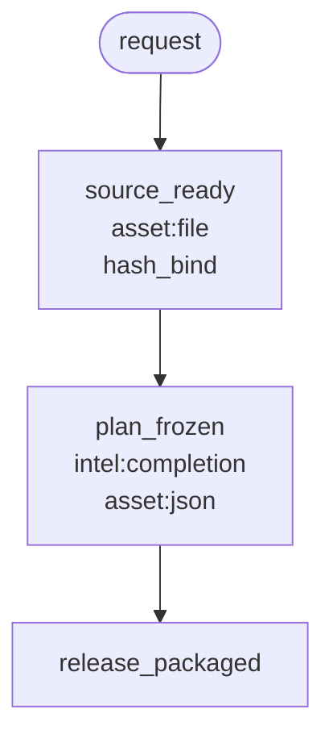

# M8M harness builder

A **skill that writes a split**: milestones, FlowSteps, tools, one table, one flowchart.

**Milestones are the harness.** Each one is a person-shaped checkpoint: it must produce a declared asset (file, image, json proof, data). If that asset is not produced, the run **BLOCKs**. The next milestone does not start.

**FlowSteps are a guide**, like a normal skill. Each FlowStep is atomic and prefers **one** tool (the builder should develop it: fetch a table, call MCP, crop, hash). The tool is optional. Follow the table order. If the tool fails, recover like a normal agent. How you get the milestone asset is not a compulsory path.

```text
identify milestones
  → FlowSteps (small goals) inside each
  → tools: existing | promote from a skill script | generate new
  → planning/m8m-flowchart.md  (chart + table)
  → scaffold flow.yaml + tool stubs
```

| Word | Meaning |
| --- | --- |
| **Milestone** | Harness checkpoint. `this.in` is `previous.out`. Required asset, or BLOCK. |
| **FlowStep** | Atomic goal inside a milestone. One preferred tool. Table order is a guide. Tool fail → agent. |
| **Tool** | Python at `<repo>/flowsteps/tools/<id>/`. Optional. Generate-new is a sketch. |

## Run

Works in **Codex** (`$m8m-harness-builder`) and **Claude Code**.

```powershell
python scripts/run_m8m.py --target <skill-or-flow-dir> --codebase <repo>
```

```powershell
python scripts/audit_harness.py --target <skill-or-flow-dir>
python scripts/generate_harness.py --codebase <repo> --from-audit <skill>/planning/flowstep-audit.json
```

Deliverables:

- `planning/flowstep-audit.md`
- `planning/m8m-flowchart.md` — mermaid + toolbox table
- `<repo>/flowsteps/flows/<flow_id>/`
- `<repo>/flowsteps/tools/<id>/` (seed or stub)
- `<repo>/.agents/skills/<name>/SKILL.md` and `<repo>/.claude/skills/<name>/SKILL.md`

Generate-new / stub tools are expected. The factory **PASSes** when the chart, table, stubs, and **per-milestone asset schemas** exist. Fill in real `tool.py` later. A missing milestone asset at **run** time is BLOCKED.

## Toolbox table (on the chart)

| Milestone | Intelligence | Existing toolbox | Promote from a skill script | Generate new |
| --- | --- | --- | --- | --- |
| `source_ready` | `none` | `hash_bind` | `ingest` ← `steps/ingest/tool.py` | — |
| `plan_frozen` | `completion` | `schema_validate` | — | `compact_editorial_config` |

## Chart



`asset:file` / `asset:image` / `asset:json` / `asset:data` is the harness policy on that node. No asset → BLOCK.

The **FlowSteps (guide)** table on the same markdown is the sequence inside the node. Prefer that tool. If it fails, find a way. Do not skip the asset.

If/else and foreach are optional YAML on a milestone (`next.when` / `foreach`). They show up on the same chart when the split has them.

A name like `crop_4x5` on `--milestone` is a **note** (“looks like a tool”), not a refusal to draw.

## Install

**Codex**

```powershell
git clone https://github.com/dse120071750/m8m-harness-builder.git $env:USERPROFILE\.codex\skills\m8m-harness-builder
pip install -r $env:USERPROFILE\.codex\skills\m8m-harness-builder\requirements.txt
```

```bash
git clone https://github.com/dse120071750/m8m-harness-builder.git ~/.codex/skills/m8m-harness-builder
pip install -r ~/.codex/skills/m8m-harness-builder/requirements.txt
```

**Claude Code**

```powershell
git clone https://github.com/dse120071750/m8m-harness-builder.git $env:USERPROFILE\.claude\skills\m8m-harness-builder
pip install -r $env:USERPROFILE\.claude\skills\m8m-harness-builder\requirements.txt
```

```bash
git clone https://github.com/dse120071750/m8m-harness-builder.git ~/.claude/skills/m8m-harness-builder
pip install -r ~/.claude/skills/m8m-harness-builder/requirements.txt
```

Repo-local: `<repo>/.agents/skills/m8m-harness-builder/` or `<repo>/.claude/skills/m8m-harness-builder/`.

```powershell
pip install -r requirements.txt
python -m unittest discover -s tests -v
```

`validate_harness.py` is optional (filling in tools). `run_flow.py` is the harness: missing milestone asset → BLOCK.

## Layout

```text
SKILL.md                 writer working method
scripts/                 audit, generate, flowchart, optional run/validate
templates/               stubs
examples/text_pipeline   fixture
```
