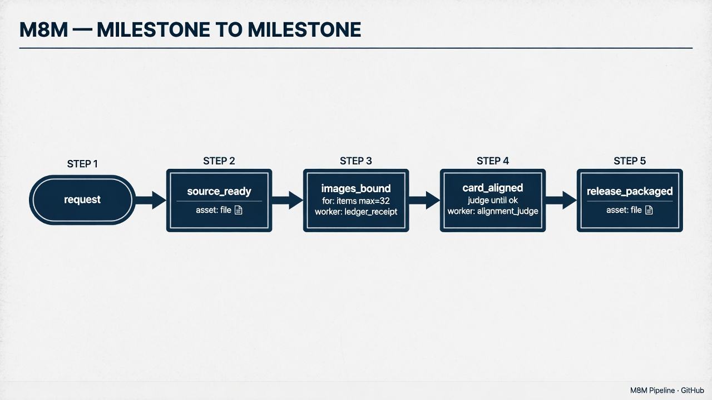

# M8M harness builder

[](https://github.com/dse120071750/m8m-harness-builder/actions/workflows/tests.yml)

[中文](#中文) · [English](#english)

给 Codex / Claude 用的 skill。它把一条 skill 拆成里程碑、FlowStep、工具，再写出一张表和一张流程图。

M8M 是 milestone to milestone，里程碑到里程碑。它是轻量 skill writer，不是 production OS。

---

# 中文

## 问题

要出图、出包、抓文件、做渲染的 skill，老栽同一类坑。

1. 模型把活全干了。session 里写 SQL、裁图、Playwright、一次性 downloader。本来该是 typed 的小事，变成 prompt。
2. 工具住在 skill 文件夹。脚本躺在 `~/.codex/skills`、`~/.claude/skills`，不在产品 repo。下一轮又现场发明一遍。
3. n8n 太硬。一次 HTTP、一次 crop 就是一个画布节点。人要检查的关卡（来源绑好了、计划定了）被动作节点盖住。
4. 管太死也不行。工具一失败就不让 agent 找路，或者把 FlowStep 当成 production 护栏，管道就死了。关卡里面仍是普通 skill。

问题不是「用了 AI」。是 AI 当第一手，该交出来的东西没有护栏，该是 Python 的东西没有首选 repo 工具。

## 解法

把 n8n 的粒度反过来。I/O 还是 typed。画布升到 Milestone（里程碑）。里面放 FlowStep。每个 FlowStep 优先用一支 repo 工具。Builder 要把这支工具做出来：抓表、调 MCP、crop、hash。工具没有或挂了，就像普通 agent 找路。里程碑产出不能商量。

```text
n8n:   节点 = 一个动作
M8M:   节点 = 一个里程碑（护栏）
       this.in = previous.out
       FlowStep = 节点里的原子目标（指引）
       Tool = 这个 FlowStep 首选的一支 Python（可选）
```

| 词 | 硬性？ | 意思 |
| --- | --- | --- |
| Milestone（里程碑） | 是，护栏 | 人在流程里停下来检查的关卡。输入就是上一关输出。必须交出已声明的 asset：文件、图片、json 证明或数据。交不出来就 BLOCK。下一关不开始。 |
| FlowStep（流程步） | 指引 | 里程碑里面的原子目标，比如绑五张图、抓一条 record。优先一支工具。顺序跟表走。怎么做到，像普通 skill。 |
| Tool（工具） | 首选，可选 | Python，放在 `<repo>/flowsteps/tools/<id>/`。Builder 该开发它：已有、从 skill script promote、或 generate-new stub。失败就找路，目标仍是里程碑产出。 |

这个 skill 就干这件事：

```text
认出里程碑
  → 每个里面列出 FlowStep（原子；优先一支工具）
  → 开发该工具（existing / promote / generate-new）
  → 写一张 FlowStep 表 + 一张里程碑流程图
     （for = ledger 里程碑；if = judge until ok）
  → scaffold flow.yaml 和 tool stub
```

`$m8m-harness-builder` 写这个拆法。名字长得像 `crop_*` 不会拒绝画图。Stub 工具是能用的草图。里程碑 output schema 不是草图。

## 表（指引）

两张表写进 `planning/m8m-flowchart.md`。

FlowSteps 是每个关卡里面的顺序。按表优先用那支工具。可选。失败就像普通 agent 找路。里程碑产出仍是硬的。

| Milestone | # | FlowStep | 首选工具 |
| --- | ---: | --- | --- |
| `source_ready` | 1 | `fetch_record` | `fetch_record` |
| `source_ready` | 2 | `hash_bind` | `hash_bind` |
| `plan_frozen` | 1 | `compact_plan` | `compact_editorial_config` |
| `release_packaged` | 1 | `materialize_package` | `materialize_package` |

来源说这支 Python 从哪来。现成 toolbox、把 skill script promote 进 repo、或 generate-new。Generate-new 是 builder 该写的工具，stub 算草图。

| Milestone | Asset | 现成 toolbox | 从 skill script promote | Generate new |
| --- | --- | --- | --- | --- |
| `source_ready` | `file` | `hash_bind` | `fetch_record` ← `scripts/fetch_record.py` | — |
| `plan_frozen` | `json` | — | — | `compact_editorial_config` |
| `release_packaged` | `file` | — | `materialize_package` ← `scripts/package.py` | — |

FlowStep 按表的顺序走。别把这条路径当成 production lock。别跳过产出。

## 图（护栏）

一张图。节点是里程碑，不是 crop。每个节点标必交的 asset。没有就 BLOCKED。FlowStep 不是额外节点，它们在上面的表里。GitHub 上用 PNG/JPEG，不用 mermaid 富文本。



| 种类 | 里程碑上的证明 |
| --- | --- |
| `file` | `asset.path` + `asset.sha256` |
| `image` | 同一套文件回执，图的 bytes |
| `json` | 封闭对象，必填字段 |
| `data` | 同上：typed 必填字段 |

**for** 和 **judge（if）** 都是里程碑。内部 worker（repo 工具）写出 `{ok: true|false}` 收据，才能往下走。模型不能填 `ok`。

- **for：** 上一关交出 ledger（typed 数组 + `maxItems`）。这一关按 ledger 逐条产出，直到 `remaining=0`。例如从数据库拉图片列表 → 待办 ledger → 绑完每一张。
- **judge（if）：** 做到 worker 说 ok 为止。出图、空间对齐永远走这一关。`ok: false` 还有预算就停在本关重做；预算用完 BLOCK。
- 没有 exclusive `next.when`。url / text 只是产出上的字段。

| Milestone | loop | Worker |
| --- | --- | --- |
| `images_bound` | for（ledger `items` max=32） | `ledger_receipt` |
| `card_aligned` | judge until ok | `alignment_judge` |

`--milestone` 写成 `crop_4x5` 只是备注：看起来像工具。不是拒绝画图。

## 什么硬，什么不硬

| 事件 | 结果 |
| --- | --- |
| 首选 FlowStep 工具失败 | 像普通 agent 找路（`on_tool_fail: need_model`）。先用工具。 |
| 里程碑产出缺失或不合格 | BLOCK。下一关不开始。 |
| Worker 收据 `ok: false`，还有预算 | 停在本关（for 下一条 / judge 重做）。 |
| Worker 收据 `ok: false`，预算用完 | BLOCK。 |
| 收据 `ok: true` 但产出不合格 | BLOCK。收据不能免产出。 |
| Generate-new / stub `tool.py` | Writer PASS。稍后填。 |
| 里程碑上的 intelligence | 可选，用来做出产出。不能跳过首选工具。不能挑选下一个里程碑。不能取消 for 检查。 |

```yaml
- id: source_ready
  asset:
    kind: file
  flowsteps:
    - id: fetch_record
      tool: fetch_record
    - id: hash_bind
      tool: hash_bind
  on_tool_fail: need_model
```

工具在 `<repo>/flowsteps/tools/`，不在 `~/.codex/skills` 或 `~/.claude/skills`。教学合约在 flow 上：`<repo>/flowsteps/flows/<id>/references/`。

## 怎么跑

Codex（`$m8m-harness-builder`）和 Claude Code 都能用。

```powershell
python scripts/run_m8m.py --target <skill-or-flow-dir> --codebase <repo>
```

```powershell
python scripts/audit_harness.py --target <skill-or-flow-dir>
python scripts/generate_harness.py --codebase <repo> --from-audit <skill>/planning/flowstep-audit.json
```

会写出：

- `planning/flowstep-audit.md`
- `planning/m8m-flowchart.md`：图（护栏）+ FlowStep 表（指引）+ For/Judge 表
- `<repo>/flowsteps/flows/<flow_id>/`
- `<repo>/flowsteps/tools/<id>/`（seed 或 stub）
- `<repo>/.agents/skills/<name>/SKILL.md` 和 `<repo>/.claude/skills/<name>/SKILL.md`

图、表、stub、每个里程碑的 asset schema 都在，factory 就 PASS。`validate_harness.py` 可选，用来把工具填实。`run_flow.py` 是护栏：工具失败走 agent；没有产出或 worker 收据不是 ok 就 BLOCK。

真实样本（一篇文章做成七页 infographic）：[examples/article_infographic/planning/m8m-flowchart.md](examples/article_infographic/planning/m8m-flowchart.md)

## 安装

```bash
npx skills add dse120071750/m8m-harness-builder
```

Codex：

```powershell
git clone https://github.com/dse120071750/m8m-harness-builder.git $env:USERPROFILE\.codex\skills\m8m-harness-builder
pip install -r $env:USERPROFILE\.codex\skills\m8m-harness-builder\requirements.txt
```

```bash
git clone https://github.com/dse120071750/m8m-harness-builder.git ~/.codex/skills/m8m-harness-builder
pip install -r ~/.codex/skills/m8m-harness-builder/requirements.txt
```

Claude Code：

```powershell
git clone https://github.com/dse120071750/m8m-harness-builder.git $env:USERPROFILE\.claude\skills\m8m-harness-builder
pip install -r $env:USERPROFILE\.claude\skills\m8m-harness-builder\requirements.txt
```

```bash
git clone https://github.com/dse120071750/m8m-harness-builder.git ~/.claude/skills/m8m-harness-builder
pip install -r ~/.claude/skills/m8m-harness-builder/requirements.txt
```

Repo 里：`<repo>/.agents/skills/m8m-harness-builder/` 或 `<repo>/.claude/skills/m8m-harness-builder/`。

```powershell
pip install -r requirements.txt
python -m unittest discover -s tests -v
```

## 目录

```text
SKILL.md                 writer 工作方法
scripts/                 audit、generate、flowchart，可选 run/validate
templates/               stubs
examples/text_pipeline           fixture
examples/article_infographic     real audit sample
references/                      milestone + tool-vs-intelligence
```

---

# English

A Codex / Claude skill that splits another skill into milestones, FlowSteps, and tools, then writes one table and one flowchart.

M8M means milestone to milestone. It is a small skill writer, not a production OS.

## The problem

Skills that ship assets (infographics, packages, fetches, renders) keep hitting the same bugs.

1. The model does the whole job. In the session it writes SQL, crop math, Playwright, or a one-off downloader. Work that should be typed becomes a prompt.
2. Tools live in the skill folder. Scripts sit in `~/.codex/skills` or `~/.claude/skills` instead of the product repo. The next run invents them again.
3. n8n is too stiff. Each HTTP call and crop is its own canvas node. The checkpoint a person would inspect ("source is bound", "plan is frozen") disappears under action nodes.
4. The other extreme is a dead pipeline. If a tool fails and the agent cannot recover, or if FlowSteps act like a production guardrail, the run stops for the wrong reason. Inside a checkpoint, the work is still a normal skill.

The problem is not that AI exists. The problem is using the model first, with no check on the thing that must exist, and no preferred repo tool for the thing that should be Python.

## The solution

Keep n8n's typed I/O. Raise the canvas to milestones. Put FlowSteps inside each one. Each FlowStep prefers one repo tool. The builder should write that tool (fetch a table, call MCP, crop, hash). If the tool is missing or fails, recover the way a normal agent would. The milestone asset still has to exist.

```text
n8n:   node = one action
M8M:   node = one milestone (harness)
       this.in = previous.out
       FlowSteps = atomic goals inside that node (guide)
       Tool = the one preferred Python for a FlowStep (optional)
```

| Word | Compulsory? | Meaning |
| --- | --- | --- |
| Milestone | Yes. This is the harness. | A checkpoint a person would inspect. Input is the previous output. It must produce a declared asset: file, image, json proof, or data. If that asset is missing, BLOCK. The next milestone does not start. |
| FlowStep | Guide | An atomic goal inside a milestone (bind five images, fetch a record). Prefers one tool. Follow the table order. How you get there is a normal skill. |
| Tool | Preferred, optional | Python at `<repo>/flowsteps/tools/<id>/`. The builder should write it: existing, promote from a skill script, or a generate-new stub. If it fails, find another way. The target is still the milestone asset. |

The skill does this:

```text
identify milestones
  → list FlowSteps inside each (atomic; prefer ONE tool)
  → develop that tool (existing / promote / generate-new)
  → write one FlowStep table + one milestone flowchart
     (for = ledger milestone; if = judge until ok)
  → scaffold flow.yaml and tool stubs
```

`$m8m-harness-builder` writes that split. A name like `crop_*` is not a reason to refuse the chart. A stub tool is a usable sketch. The milestone output schema is not a sketch.

## Table (guide)

`planning/m8m-flowchart.md` gets two tables.

The FlowStep table is the order inside each checkpoint. Prefer the named tool, in this order. The tool is optional. If it fails, recover like a normal agent. The milestone asset is still required.

| Milestone | # | FlowStep | Preferred tool |
| --- | ---: | --- | --- |
| `source_ready` | 1 | `fetch_record` | `fetch_record` |
| `source_ready` | 2 | `hash_bind` | `hash_bind` |
| `plan_frozen` | 1 | `compact_plan` | `compact_editorial_config` |
| `release_packaged` | 1 | `materialize_package` | `materialize_package` |

The origin table says where the Python comes from: existing toolbox, promote a skill script into the repo, or generate-new. Generate-new is a tool the builder should write. A stub counts as a sketch.

| Milestone | Asset | Existing toolbox | Promote from a skill script | Generate new |
| --- | --- | --- | --- | --- |
| `source_ready` | `file` | `hash_bind` | `fetch_record` ← `scripts/fetch_record.py` | — |
| `plan_frozen` | `json` | — | — | `compact_editorial_config` |
| `release_packaged` | `file` | — | `materialize_package` ← `scripts/package.py` | — |

Follow the FlowStep order. Do not treat that path as a production lock. Do not skip the asset.

A real run on a seven-page article infographic skill is in [examples/article_infographic/planning/m8m-flowchart.md](examples/article_infographic/planning/m8m-flowchart.md).

## Chart (harness)

One chart. Nodes are milestones, not crops. Each node names the required asset. If it is missing, the run is BLOCKED. FlowSteps are not extra nodes. They live in the table above. On GitHub this is a JPEG, not a mermaid rich display.


| Kind | Proof on the milestone |
| --- | --- |
| `file` | `asset.path` + `asset.sha256` |
| `image` | same file receipt, for a picture |
| `json` | closed object with required fields |
| `data` | same: typed required fields |

**for** and **judge (if)** are milestones. An internal worker (repo tool) writes `{ok: true|false}`. That receipt is the only proceed guard. The model must not set `ok`.

- **for:** the previous asset is a ledger (typed array + `maxItems`). This milestone produces each item's asset until `remaining=0`. Example: fetch image rows from a DB → freeze the todo list → bind every image.
- **judge (if):** keep going until the worker says ok. Image generation and spatial alignment always use this. `ok: false` with budget left → stay and retry. Budget gone → BLOCK.
- No exclusive `next.when`. url / text is a field on the asset.

| Milestone | loop | Worker |
| --- | --- | --- |
| `images_bound` | for (ledger `items` max=32) | `ledger_receipt` |
| `card_aligned` | judge until ok | `alignment_judge` |

A name like `crop_4x5` on `--milestone` is a note that it looks like a tool. It is not a refusal to draw.

## What is rigid, and what is not

| Event | Result |
| --- | --- |
| Preferred FlowStep tool fails | Recover like a normal agent (`on_tool_fail: need_model`). Try the tool first. |
| Milestone asset missing or invalid | BLOCK. The next milestone does not start. |
| Worker receipt `ok: false`, budget left | Stay on this milestone (next ledger item / retry judge). |
| Worker receipt `ok: false`, budget gone | BLOCK. |
| Receipt `ok: true` but asset missing/invalid | BLOCK. The receipt cannot waive the asset. |
| Generate-new / stub `tool.py` | Writer PASS. Fill it in later. |
| Intelligence on a milestone | Optional judgment for producing the asset. Must not skip the preferred tool. Must not pick the next milestone. Must not cancel the for-check. |

```yaml
- id: source_ready
  asset:
    kind: file
  flowsteps:
    - id: fetch_record
      tool: fetch_record
    - id: hash_bind
      tool: hash_bind
  on_tool_fail: need_model
```

Tools belong in `<repo>/flowsteps/tools/`, not in `~/.codex/skills` or `~/.claude/skills`. Teaching contracts belong on the flow: `<repo>/flowsteps/flows/<id>/references/`.

## Run

Works in Codex (`$m8m-harness-builder`) and Claude Code.

```powershell
python scripts/run_m8m.py --target <skill-or-flow-dir> --codebase <repo>
```

```powershell
python scripts/audit_harness.py --target <skill-or-flow-dir>
python scripts/generate_harness.py --codebase <repo> --from-audit <skill>/planning/flowstep-audit.json
```

This writes:

- `planning/flowstep-audit.md`
- `planning/m8m-flowchart.md`: chart (harness), FlowStep table (guide), origin table, For/Judge tables
- `<repo>/flowsteps/flows/<flow_id>/`
- `<repo>/flowsteps/tools/<id>/` (seed or stub)
- `<repo>/.agents/skills/<name>/SKILL.md` and `<repo>/.claude/skills/<name>/SKILL.md`

The factory PASSes when the chart, tables, stubs, and each milestone's asset schema exist. `validate_harness.py` is optional. Use it when you fill in tools. `run_flow.py` is the harness: a failed tool goes to the agent; a missing asset or a not-ok worker receipt BLOCKs.

## Install

```bash
npx skills add dse120071750/m8m-harness-builder
```

Codex:

```powershell
git clone https://github.com/dse120071750/m8m-harness-builder.git $env:USERPROFILE\.codex\skills\m8m-harness-builder
pip install -r $env:USERPROFILE\.codex\skills\m8m-harness-builder\requirements.txt
```

```bash
git clone https://github.com/dse120071750/m8m-harness-builder.git ~/.codex/skills/m8m-harness-builder
pip install -r ~/.codex/skills/m8m-harness-builder/requirements.txt
```

Claude Code:

```powershell
git clone https://github.com/dse120071750/m8m-harness-builder.git $env:USERPROFILE\.claude\skills\m8m-harness-builder
pip install -r $env:USERPROFILE\.claude\skills\m8m-harness-builder\requirements.txt
```

```bash
git clone https://github.com/dse120071750/m8m-harness-builder.git ~/.claude/skills/m8m-harness-builder
pip install -r ~/.claude/skills/m8m-harness-builder/requirements.txt
```

Repo-local: `<repo>/.agents/skills/m8m-harness-builder/` or `<repo>/.claude/skills/m8m-harness-builder/`.

```powershell
pip install -r requirements.txt
python -m unittest discover -s tests -v
```

## Layout

```text
SKILL.md                 writer working method
scripts/                 audit, generate, flowchart, optional run/validate
templates/               stubs
examples/text_pipeline           fixture
examples/article_infographic     real audit sample
references/                      milestone + tool-vs-intelligence
```
