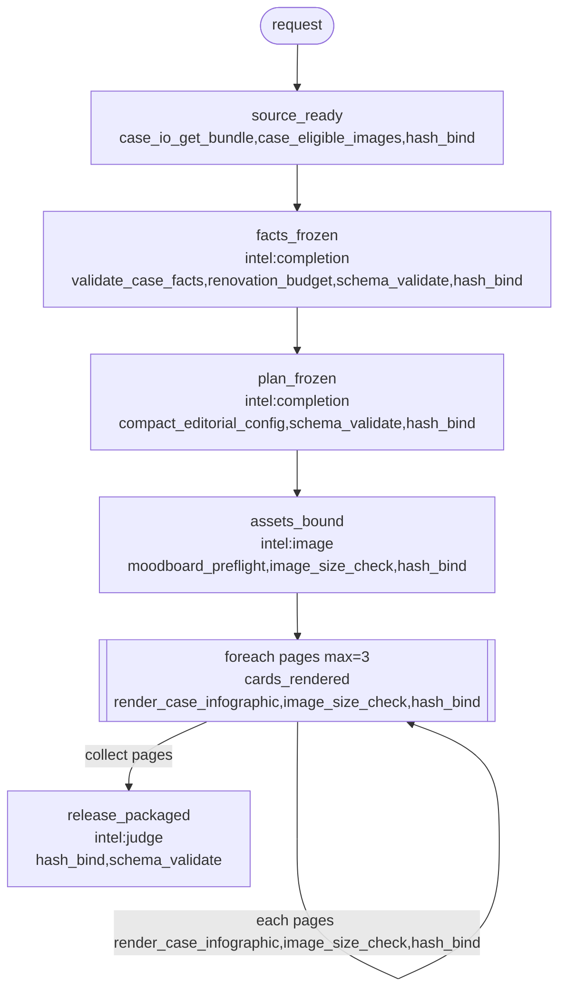

# M8M

**M8M is milestone-to-milestone.** A semantic n8n.

Three words. Do not mix them:

| Word | What it is | What it is not |
| --- | --- | --- |
| **Milestone** | The only canvas node. A human checkpoint. Input schema **is** the previous milestone’s output schema. | Not a crop. Not a fetch. Not a tool. |
| **FlowStep** | A tool-heavy unit **inside** a milestone. Listed on that milestone. Never drawn on the canvas. | Not a milestone. Not free-form session code. |
| **Tool** | The premade Python implementation a FlowStep runs: `<repo>/flowsteps/tools/<id>/`. Input schema in, output schema out. | Not stored in `~/.codex/skills` or `~/.claude/skills`. |
| **Gate / foreach** | n8n IF and Loop Over Items, as JSON Schema. `when` = instance validates. `foreach` = typed array + `maxItems`. | Not a milestone. Not semantic approval. Not `NEED_MODEL`. |

This is a **skill for making skills** that produce assets or a standardized workflow — not another session transcript.

## The problem

Codex and Claude usually **overuse intelligence**. For every small task they generate fresh code in the session: a crop, a hash, a fetch, a one-off Playwright script. A skill is developed as markdown and a worker. It does **not** come with a toolbox. The scripts that do exist land in `~/.codex/skills` or `~/.claude/skills`, not in the project. Different products share one skill folder, so tools mix.

That is the problem. The flow is not controllable. The skill does not ship an asset.

## What M8M is

```text
n8n:     node = one action          (HTTP, crop, IF, hash)
M8M:     node = one milestone
         next.in   = previous.out   (fixed schema)
         FlowSteps = tool-heavy units *inside* that milestone
         Tool      = premade Python those FlowSteps run
```

```text
request
  → milestone source_ready
        FlowSteps: normalize, hash_bind   (tools)
        out schema PASSes
  → milestone plan_frozen
        in  = source_ready.out
        FlowSteps: hash_bind, schema_validate
        intelligence only if the schema cannot compute the plan
        out schema PASSes
  → milestone assets_bound
        in  = plan_frozen.out
        FlowSteps: crop, hash_bind, image_size_check
        out schema PASSes
  → milestone release_packaged
        in  = previous.out
        out = asset {path, sha256}
```

The driver advances **milestone → milestone**. It does not draw crop then hash then IF. Crop is a FlowStep inside a milestone. The tool is the Python in the project toolbox.

Invoke as **`$m8m-harness-builder`** in Codex, or load the `m8m-harness-builder` skill in Claude Code.

## Why M8M, not another agent loop

| n8n | Usual Codex / Claude skill | M8M |
| --- | --- | --- |
| Action node | Generate code for the tiny task | **FlowStep** inside a milestone, running a **tool** |
| Integrations on the canvas | Scripts dumped in `~/.codex/skills` or `~/.claude/skills` | `<repo>/flowsteps/tools/<id>/` |
| Graph of HTTP/IF/crop | Markdown + worker, no toolbox | **Milestone → milestone** |
| Typed I/O | Chat in, chat out | **This milestone.in = previous milestone.out** |
| Runs to a side effect | Stops at a draft | Stops at an **asset** |

A milestone named `crop_4x5` or `fetch_record` is invalid. Those names are FlowSteps (and tools). Use them heavily. Do not regenerate them in the session.

## Three rules

### 1. Milestone to milestone

A milestone is something you would stop and inspect.

- Valid milestones: `source_ready`, `plan_frozen`, `assets_bound`, `cards_rendered`, `release_decided`
- Invalid as milestones: `crop_4x5`, `fetch_record`, `hash_bind` — those are FlowSteps / tools

The next milestone starts only when this one’s **output schema** PASSes. That object **is** the next milestone’s **input schema**.

### 2. FlowSteps live inside the milestone (tool-heavy)

Each milestone lists the FlowSteps it may run. Each FlowStep runs one **tool**.

| | Tool (default) | Intelligence (exception) |
| --- | --- | --- |
| What | Premade Python a FlowStep runs | Judgment the schema cannot compute |
| Where | `<repo>/flowsteps/tools/<id>/` | Optional `NEED_MODEL` *on the milestone* |
| Contract | Same input → same action. Fixture-testable | Draft only. FlowSteps still emit the payload |
| Examples | fetch, crop, hash, render, package, validate | plan, caption, choose, release-judge |

The agent **calls** tools through FlowSteps. It does not write SQL, crop math, or Playwright in the session. Intelligence must not pick the next milestone.

Every audit and every generated skill must emit this table. Contract:
[`contracts/tool_vs_intelligence_table_v1.schema.json`](contracts/tool_vs_intelligence_table_v1.schema.json).

| id | class | test | why |
| --- | --- | --- | --- |
| `fetch_record` | `tool` | same id → same record | structured read; MCP/DB/HTTP GET |
| `crop_4x5` | `tool` | fixture PNG in, PNG+hash out | pixel math; FlowStep, not a milestone |
| `hash_bind` | `tool` | same bytes → same sha256 | pure bind; `file_ref_v2` receipt |
| `schema_validate` | `tool` | pass/fail from rules | JSON Schema gate |
| `render_html_shell` | `tool` | fixture HTML → screenshot hash | fixed viewport generator |
| `materialize_package` | `tool` | typed inputs → zip/manifest | assembly of already-valid receipts |
| `plan_frozen` | `intelligence` | no fixture without a model | editorial plan is not a typed transform |
| `choose_lesson` | `intelligence` | no fixture without a model | judgment among plausible alternatives |
| `image_generate` | `intelligence` | model produces bytes | invention; `hash_bind` still sizes and binds |
| `release_judge` | `intelligence` | not a pixel measurement | taste / teaching quality; footer geometry stays a tool |

Columns are fixed: **id**, **class**, **test**, **why**.

### 3. Previous schema in. This schema out.

```text
validate milestone input.schema.json   (= previous output.schema.json)
  → run the FlowSteps listed on this milestone (each FlowStep → one tool)
  → validate milestone output.schema.json
  → that object is the next milestone's input
```

- The next milestone reads a typed receipt, not a transcript.
- `{ok: boolean}` stubs are invalid.
- A file is a `file_ref_v2` (`path` + `sha256`).
- A BLOCKED run stays BLOCKED.

### 4. If/else and loop are schema gates

n8n IF/Switch/Loop exist in M8M as **control on a milestone**, not as canvas nodes.

```yaml
next:
  - when: schemas/gates/kind_url.schema.json
    then: url_ready
  - when: schemas/gates/kind_file.schema.json
    then: file_ready
else: BLOCKED

foreach:
  path: pages
  item_schema: schemas/page_v1.json
  tools: [hash_bind]
  max_items: 7
  collect: pages
```

`when` means the previous (or this) payload **validates** against that JSON Schema — the same engine as `schema_validate`. First match wins. `else` is required. `foreach` walks a typed array that already has `maxItems` on the previous output schema. A milestone named `if_*` / `loop_*` is invalid. There is no “loop until the model is happy”.

Audit infers these from **existing** output-schema fields (`enum` / `const` / array `maxItems`). Generate writes `schemas/gates/*.schema.json`. Intelligence may fill a field; it may not pick `then`.

Audit and generate both write **one** chart file, `planning/m8m-flowchart.md`, and a **toolbox plan** on that chart: existing toolbox / promote from a skill script / generate new. Tools are listed on each milestone node.

## Worked example: case infographic

Real product flow: `case_infographic_zh_hant_v1`. Six milestones. Crop/hash/render stay tools *inside* the milestone. Intelligence is only on the checkpoints that a schema cannot compute.

### Chart (`planning/m8m-flowchart.md`)



`cards_rendered` is a foreach **once** `pages` on the previous output schema declares `maxItems: 3`. Today the live schema has `page_count: {const: 3}` and a `pages` array; M8M loop requires `maxItems` on that array. The diamond/loop is schema control, not a model saying the cards look good.

### Toolbox plan (same file, and in the audit)

| Milestone | Intelligence | Existing toolbox | Promote from a skill script | Generate new |
| --- | --- | --- | --- | --- |
| `source_ready` | `none` | `case_io_get_bundle`<br>`case_eligible_images`<br>`hash_bind` | — | — |
| `facts_frozen` | `completion` (gallery room and area estimates are not a typed transform) | `validate_case_facts`<br>`renovation_budget`<br>`schema_validate`<br>`hash_bind` | — | — |
| `plan_frozen` | `completion` (three-page editorial copy invents headline and service bullets) | `compact_editorial_config`<br>`schema_validate`<br>`hash_bind` | — | — |
| `assets_bound` | `image` (ImageGen produces the square moodboard; size/hash are tools) | `moodboard_preflight`<br>`image_size_check`<br>`hash_bind` | — | — |
| `cards_rendered` | `none` | `render_case_infographic`<br>`image_size_check`<br>`hash_bind` | — | — |
| `release_packaged` | `judge` (teaching-quality and visible-copy review is not a pixel measurement) | `hash_bind`<br>`schema_validate` | — | — |

If a skill still has private scripts, that column fills like `fastdl_carousel_download ← scripts/automate_fastdl.py`. If there is no seed and no script, the tool lands in **Generate new** and stays FINDINGS until a fixture exists.

### Schema in, schema out

`source_ready` output **is** `facts_frozen` input (plus later refs). Abbreviated from `schemas/case_infographic_source_v1.json`:

```json
{
  "type": "object",
  "required": ["case_id", "eligible_count", "output_locale"],
  "properties": {
    "case_id": { "type": "string", "minLength": 1 },
    "eligible_count": { "type": "integer", "minimum": 2 },
    "eligible": { "type": "array" },
    "output_locale": { "const": "zh-Hant-HK" }
  }
}
```

`cards_rendered` output (typed pages, not a transcript). Loop-ready form:

```json
{
  "type": "object",
  "required": ["page_count", "pages", "width", "height"],
  "properties": {
    "page_count": { "const": 3 },
    "pages": {
      "type": "array",
      "minItems": 3,
      "maxItems": 3,
      "items": {
        "type": "object",
        "required": ["path", "sha256"],
        "properties": {
          "path": { "type": "string", "minLength": 1 },
          "sha256": { "type": "string", "pattern": "^[0-9a-f]{64}$" }
        }
      }
    },
    "width": { "const": 1080 },
    "height": { "const": 1350 }
  }
}
```

`release_packaged` stops at an asset-shaped package (`path` + `sha256` on the last milestone after generate). The driver never asks a model whether to take the next edge.

## Ownership

```text
this skill ($m8m-harness-builder)        doctrine + audit + driver
<repo>/flowsteps/tools/<tool_id>/        tools (premade Python)
<repo>/flowsteps/flows/<flow_id>/        milestones + which FlowSteps they run
<repo>/flowsteps/flows/<flow_id>/references/   teaching contracts (instruction, context, judge rubrics)
```

Do not put product tools **or teaching contracts** in `~/.codex/skills` or `~/.claude/skills`. Skill `references/*.md` is promoted onto the flow the same way skill scripts are promoted into `flowsteps/tools/`.

## Factory

Five milestones in `flows/m8m_build_v1.yaml`:

```powershell
python scripts/run_m8m.py --target <skill-or-flow-dir> --codebase <repo>
```

Writes the audit, writes **one** flowchart (`planning/m8m-flowchart.md`: milestones, schema if/else, foreach), copies seed **tools** into the project, generates the milestone chain (each input schema is the previous output; FlowSteps listed per milestone), rewrites that same flowchart from the flow YAML, validates, and ships `<repo>/.agents/skills/<name>/SKILL.md` plus `<repo>/.claude/skills/<name>/SKILL.md`.

```powershell
python scripts/audit_harness.py --target <skill-or-flow-dir>
python scripts/generate_harness.py --codebase <repo> --from-audit <skill>/planning/flowstep-audit.json
python scripts/run_flow.py --codebase <repo> --flow-id <flow_id> --run-dir <run> --request <request.json>
```

Read [references/milestone.md](references/milestone.md) and [references/tool-vs-intelligence.md](references/tool-vs-intelligence.md).

## Install

Works in **Codex** and **Claude Code**. Product tools and teaching contracts still go in the **repo**, never in a home skill folder.

**Codex**

```powershell
git clone https://github.com/dse120071750/m8m-harness-builder.git $env:USERPROFILE\.codex\skills\m8m-harness-builder
pip install -r $env:USERPROFILE\.codex\skills\m8m-harness-builder\requirements.txt
```

```bash
git clone https://github.com/dse120071750/m8m-harness-builder.git ~/.codex/skills/m8m-harness-builder
pip install -r ~/.codex/skills/m8m-harness-builder/requirements.txt
```

**Claude Code**

```powershell
git clone https://github.com/dse120071750/m8m-harness-builder.git $env:USERPROFILE\.claude\skills\m8m-harness-builder
pip install -r $env:USERPROFILE\.claude\skills\m8m-harness-builder\requirements.txt
```

```bash
git clone https://github.com/dse120071750/m8m-harness-builder.git ~/.claude/skills/m8m-harness-builder
pip install -r ~/.claude/skills/m8m-harness-builder/requirements.txt
```

Repo-local (either host):

```text
<repo>/.agents/skills/m8m-harness-builder/
<repo>/.claude/skills/m8m-harness-builder/
```

Invoke **`$m8m-harness-builder`** in Codex, or ask Claude to use the `m8m-harness-builder` skill.

```powershell
pip install -r requirements.txt
python -m unittest discover -s tests -v
```

## Layout

```text
SKILL.md                 M8M working method
scripts/                 audit, generate, validate, run
contracts/               shared JSON schemas
references/              milestone + tool-vs-intelligence
examples/text_pipeline   fixture
templates/               generated tool / milestone stubs
```
