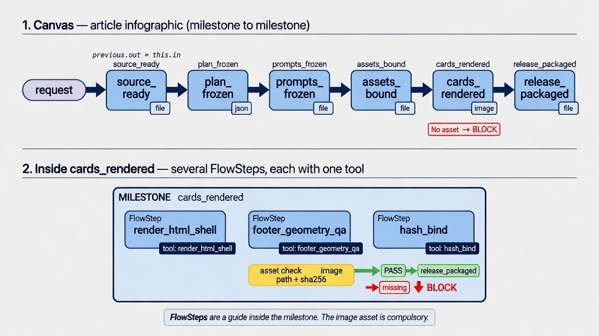

# M8M flowchart: article-infographic-maker

Two pictures. Top: milestone to milestone. Each node must hand over an
asset or the next node does not start. Bottom: open one milestone
(`cards_rendered`) — several FlowSteps, each with one preferred tool,
then the image asset check.

- flow_id: `article_infographic_zh_hant_v2`
- source: `audit`
- updated_at: 2026-08-19T21:59:03Z

## Chart

## Toolbox plan

Tools on each proposed milestone. **Existing toolbox** = already in
`<repo>/flowsteps/tools/` or an M8M seed. **Promote from a skill script** =
skill-private Python becomes that tool. **Generate new** = builder should
develop this tool; a stub is a successful sketch.

| Milestone | Intelligence | Existing toolbox | Promote from a skill script | Generate new |
| --- | --- | --- | --- | --- |
| `source_ready` | `none` | `normalize_source_blocks` `hash_bind` | — | — |
| `plan_frozen` | `completion` | `hash_bind` `schema_validate` | — | — |
| `prompts_frozen` | `completion` | `hash_bind` `schema_validate` | — | — |
| `assets_bound` | `image` | `hash_bind` `image_size_check` | — | — |
| `cards_rendered` | `none` | `render_html_shell` `footer_geometry_qa` `hash_bind` | — | — |
| `release_packaged` | `judge` | `footer_geometry_qa` `hash_bind` `materialize_package` `io_manifest` | — | — |

## Nodes

| Milestone | Asset | Intelligence | Tools | Control |
| --- | --- | --- | --- | --- |
| `source_ready` | `file` | `none` | `normalize_source_blocks`, `hash_bind` | linear |
| `plan_frozen` | `file` | `completion` | `hash_bind`, `schema_validate` | linear (emits pages ledger) |
| `prompts_frozen` | `file` | `completion` | `hash_bind`, `schema_validate` | linear |
| `assets_bound` | `file` | `image` | `hash_bind`, `image_size_check`, `ledger_receipt` | for `pages` max=7 |
| `cards_rendered` | `image` | `none` | `render_html_shell`, `footer_geometry_qa`, `hash_bind`, `ok_receipt` | judge until ok |
| `release_packaged` | `file` | `judge` | `footer_geometry_qa`, `hash_bind`, `materialize_package`, `io_manifest` | linear |

## FlowSteps (guide)

Sequence inside each milestone. Prefer the named tool. Optional.
If it fails, recover like a normal agent. The milestone asset is still compulsory.

| Milestone | # | FlowStep | Preferred tool |
| --- | ---: | --- | --- |
| `source_ready` | 1 | `normalize_source_blocks` | `normalize_source_blocks` |
| `source_ready` | 2 | `hash_bind` | `hash_bind` |
| `plan_frozen` | 1 | `hash_bind` | `hash_bind` |
| `plan_frozen` | 2 | `schema_validate` | `schema_validate` |
| `prompts_frozen` | 1 | `hash_bind` | `hash_bind` |
| `prompts_frozen` | 2 | `schema_validate` | `schema_validate` |
| `assets_bound` | 1 | `hash_bind` | `hash_bind` |
| `assets_bound` | 2 | `image_size_check` | `image_size_check` |
| `cards_rendered` | 1 | `render_html_shell` | `render_html_shell` |
| `cards_rendered` | 2 | `footer_geometry_qa` | `footer_geometry_qa` |
| `cards_rendered` | 3 | `hash_bind` | `hash_bind` |
| `release_packaged` | 1 | `footer_geometry_qa` | `footer_geometry_qa` |
| `release_packaged` | 2 | `hash_bind` | `hash_bind` |
| `release_packaged` | 3 | `materialize_package` | `materialize_package` |
| `release_packaged` | 4 | `io_manifest` | `io_manifest` |

## For (ledger)

| Milestone | Ledger path | Item schema | max_items | Worker |
| --- | --- | --- | ---: | --- |
| `assets_bound` | `pages` | `schemas/page_item_v1.json` | 7 | `ledger_receipt` |

`plan_frozen` freezes the page ledger. `assets_bound` walks it until remaining=0. One canvas node, not one node per page.

## Judge (until ok)

| Milestone | Worker | Receipt schema |
| --- | --- | --- |
| `cards_rendered` | `ok_receipt` | `schemas/cards_rendered_receipt_v1.json` |

Render and spatial alignment stay on this milestone until the worker receipt is `ok: true`. Budget gone → BLOCK.

Proceed only when the worker receipt is `ok: true` and the milestone asset PASSes.
