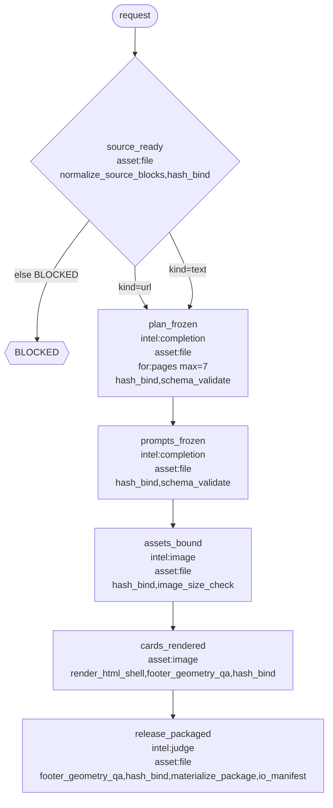

# M8M flowchart: article-infographic-maker

One chart. Milestone to milestone. Each node is a required asset
(file, image, json proof, or data). Missing it is BLOCKED.
FlowSteps inside a node are a guide (one preferred tool each), not a compulsory path.
If/else and foreach are JSON Schema checks on this.out, not tools and not semantic approval.

- flow_id: `article_infographic_zh_hant_v2`
- source: `audit`
- updated_at: 2026-08-19T21:59:03Z

## Chart

## Toolbox plan

Tools on each proposed milestone. **Existing toolbox** = already in
`<repo>/flowsteps/tools/` or an M8M seed. **Promote from a skill script** =
skill-private Python becomes that tool. **Generate new** = builder should
develop this tool; a stub is a successful sketch.

| Milestone | Intelligence | Existing toolbox | Promote from a skill script | Generate new |
| --- | --- | --- | --- | --- |
| `source_ready` | `none` | `normalize_source_blocks` `hash_bind` | — | — |
| `plan_frozen` | `completion` | `hash_bind` `schema_validate` | — | — |
| `prompts_frozen` | `completion` | `hash_bind` `schema_validate` | — | — |
| `assets_bound` | `image` | `hash_bind` `image_size_check` | — | — |
| `cards_rendered` | `none` | `render_html_shell` `footer_geometry_qa` `hash_bind` | — | — |
| `release_packaged` | `judge` | `footer_geometry_qa` `hash_bind` `materialize_package` `io_manifest` | — | — |

## Nodes

| Milestone | Asset | Intelligence | Tools | Control |
| --- | --- | --- | --- | --- |
| `source_ready` | `file` | `none` | `normalize_source_blocks`, `hash_bind` | gate |
| `plan_frozen` | `file` | `completion` | `hash_bind`, `schema_validate` | for `pages` max=7 |
| `prompts_frozen` | `file` | `completion` | `hash_bind`, `schema_validate` | linear |
| `assets_bound` | `file` | `image` | `hash_bind`, `image_size_check` | linear |
| `cards_rendered` | `image` | `none` | `render_html_shell`, `footer_geometry_qa`, `hash_bind` | linear |
| `release_packaged` | `file` | `judge` | `footer_geometry_qa`, `hash_bind`, `materialize_package`, `io_manifest` | linear |

## FlowSteps (guide)

Sequence inside each milestone. Prefer the named tool. Optional.
If it fails, recover like a normal agent. The milestone asset is still compulsory.

| Milestone | # | FlowStep | Preferred tool |
| --- | ---: | --- | --- |
| `source_ready` | 1 | `normalize_source_blocks` | `normalize_source_blocks` |
| `source_ready` | 2 | `hash_bind` | `hash_bind` |
| `plan_frozen` | 1 | `hash_bind` | `hash_bind` |
| `plan_frozen` | 2 | `schema_validate` | `schema_validate` |
| `prompts_frozen` | 1 | `hash_bind` | `hash_bind` |
| `prompts_frozen` | 2 | `schema_validate` | `schema_validate` |
| `assets_bound` | 1 | `hash_bind` | `hash_bind` |
| `assets_bound` | 2 | `image_size_check` | `image_size_check` |
| `cards_rendered` | 1 | `render_html_shell` | `render_html_shell` |
| `cards_rendered` | 2 | `footer_geometry_qa` | `footer_geometry_qa` |
| `cards_rendered` | 3 | `hash_bind` | `hash_bind` |
| `release_packaged` | 1 | `footer_geometry_qa` | `footer_geometry_qa` |
| `release_packaged` | 2 | `hash_bind` | `hash_bind` |
| `release_packaged` | 3 | `materialize_package` | `materialize_package` |
| `release_packaged` | 4 | `io_manifest` | `io_manifest` |

## Gates (if / else)

| From | When (JSON Schema) | Then |
| --- | --- | --- |
| `source_ready` | `schemas/gates/kind_url.schema.json` `kind=url` | `plan_frozen` |
| `source_ready` | `schemas/gates/kind_text.schema.json` `kind=text` | `plan_frozen` |
| `source_ready` | else | `BLOCKED` |

Intake is URL or text. That enum is on `source_ready.out`. Both branches then go to `plan_frozen`. The model does not pick the next milestone.

## Loops (foreach)

| Milestone | Path on this.out | Item schema | max_items |
| --- | --- | --- | ---: |
| `plan_frozen` | `pages` | `schemas/page_item_v1.json` | 7 |

The plan asset is a typed array of at most seven pages. That is the milestone check. Assemble still runs once. Tools are not looped.

Criterion is `schema_validate` (Draft 2020-12). There is no loop-until-the-model-is-happy.
