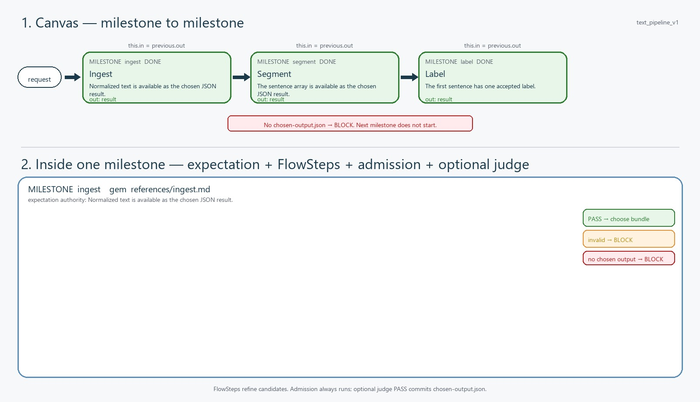

# M8M flowchart: text_pipeline_v1

One chart. Milestone to milestone. Each node declares named output ports.
FlowSteps refine candidates; admission always runs and an authored judge is optional. Without chosen-output.json the node is BLOCKED.
Run state is authoritative. Optional cross-run cache only supplies a candidate for the current judge.
Execution context is isolated: a fresh run does not inherit orchestration chat or prior-row memory.
FlowSteps inside a node are a guide (one preferred tool each), not a compulsory path.
cycle = wrap over a frozen ledger (pass preserves, fail purges). judge = optional semantic retry until PASS.
The JPEG is the audit copy: portable, human-labeled, native to review.
It is rewritten on generate and on every step edit.

- flow_id: `text_pipeline_v1`
- source: `edit`
- updated_at: 2026-09-02T12:54:59Z

## Chart

Portable JPEG for audit. Humanizer names each milestone and FlowStep.
Regenerated on generate and on every step edit (`write` / `mark`).



```text
flowchart TD
    request([request])
    ingest["ingest<br/>out:result"]
    segment["segment<br/>out:result"]
    label["label<br/>intel:completion<br/>out:result"]
    request --> ingest
    ingest --> segment
    segment --> label
```

## Toolbox plan

Tools on each proposed milestone. **Existing toolbox** = already in
`<repo>/flowsteps/tools/` or an M8M seed. **Promote from a skill script** =
skill-private Python becomes that tool. **Generate new** = builder should
develop this tool; a stub is a successful sketch.

| Milestone | Intelligence | Existing toolbox | Promote from a skill script | Generate new |
| --- | --- | --- | --- | --- |
| `ingest` | `none` | — | — | — |
| `segment` | `none` | — | — | — |
| `label` | `completion` (semantic class is not derivable from punctuation alone) | — | — | — |

## Nodes

| Milestone | What it means | Success | Declared output ports | Status | Intelligence | Tools | Control | Cache |
| --- | --- | --- | --- | --- | --- | --- | --- | --- |
| `ingest` | Ingest | Normalized text is available as the chosen JSON result. | `result` (json, one, required) | `DONE` | `none` | none | linear | off |
| `segment` | Segment | The sentence array is available as the chosen JSON result. | `result` (json, one, required) | `DONE` | `none` | none | linear | off |
| `label` | Label | The first sentence has one accepted label. | `result` (json, one, required) | `DONE` | `completion` | none | linear | off |

## FlowSteps (guide)

Sequence inside each milestone. Prefer the named tool. Optional.
If it fails, recover like a normal agent. The prompt for that step is the
matching section of the milestone gem. Admission is compulsory; semantic judgment is optional.

| Milestone | # | FlowStep | What it means | Preferred tool | Gem section |
| --- | ---: | --- | --- | --- | --- |
| (none) | | | | | |

## Cycle

None. No cycle wrap. Freeze a ledger first, then wrap milestones.

## Optional semantic judge

None. These milestones commit after structural admission with zero judge calls.

## Branch (after the milestone)

None. No branch after a milestone.

Proceed only after structural admission and, when declared, semantic judge `PASS`; then commit current named outputs as `chosen-output.json`.
Branch is after that commit. Candidate handlers never write control; the runtime-owned control call writes `branch`.
